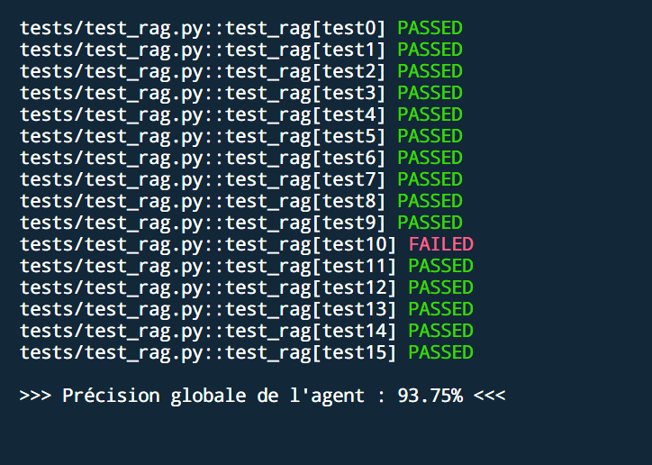

# Agent RAG chatbot

Agent conversationnel RAG permettant de garantir la Data Quality et la conformité d'un document analysé.

J'ai utilisé ce modèle de Deepseek "deepseek/deepseek-v4-flash-0731" disponible sur OpenRouter. L'usage de gros modèle ne me semblait pas adapté.

## Structure du projet

```
document-processing-chatbot/
├── src/                    # Code source principal
│   ├── models/            # Modèles 
│   ├── services/          # Services métier
│   ├── routes/            # Routes API
│   ├── middleware/        # Middlewares
│   ├── utils/             # Fonctions utilitaires
│   ├── config/            # Configuration
│   ├── api_call.py        # Fonctions appel api 
│   ├── streamlit_app.py   # Front End
│   └── main.py            # Back End
├── tests/
│   ├── unit/              # Tests unitaires
│   └── integration/       # Tests d'intégration
├── docs/                  # Documentation
├── logs/                  # Fichiers journaux
└── requirements.txt       # Dépendances Python
```

## Installation
Créer un environnement pour le projet
```bash
python -m venv /dossier_cible/my_env
source my_env/bin/activate
```
Installer les dépendances requises.
```bash
pip install -r requirements.txt
```

## Utilisation
Ouvrir deux instances de terminal, ensuite faite tourner le serveur fastapi sur l'un puis le front-end streamlit sur l'autre avec les commandes suivantes :  
- Depuis le dossier /src : ```bash uvicorn main:app --reload ``` 
- Depuis la racine : ```bash uvicorn main:app --app-dir src --reload ```
- ```bash streamlit run streamlit_app.py ```


## Tests

```bash
pytest -s -v tests/test_rag.py
```

## Résultats


Resultats obtenues lors du test de 15 questions. 

Au delà, d'un seul document la précision se dégrade car plus il y a de test plus l'appel api ralenti sur ce dernier, avec une dépense de token élevé.

## Amélioration

Lors de l'analyse de plusieurs fichiers, le contenu ne reste pas en mémoire et sont continuellement recharger. Une solution serait les vecteurs.

## Documentation

Consultez [ARCHITECTURE.md](docs/ARCHITECTURE.md) pour plus de détails sur la structure du projet.


